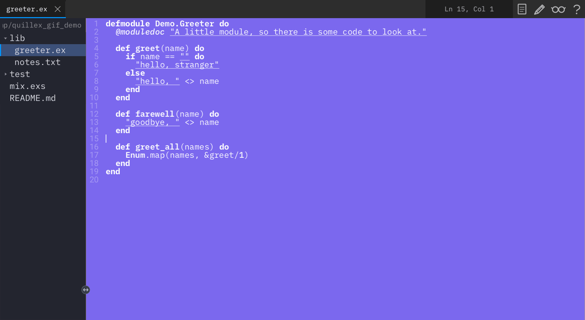

# QuillEx

A simple text editor (basically a [Gedit](https://wiki.gnome.org/Apps/Gedit) clone) written entirely in Elixir, powered by the [Scenic](https://github.com/ScenicFramework/scenic) GUI framework.

Quillex is also a reference implementation of a state architecture for Scenic
apps — redux-style stores on retained PubSub, with a hard frontend/backend
line. See **[ARCHITECTURE.md](ARCHITECTURE.md)** for the diagrams.



## Quick Start

```bash
git clone https://github.com/JediLuke/quillex.git
cd quillex
scripts/install.sh
```

That is the whole of it. Quillex is built across several forks of Scenic and
its widget library, but `mix.exs` names the exact revision of each and Mix
fetches them from GitHub — you do not need to know they exist, or clone them.

The install script checks you have Elixir, installs the system libraries
Scenic renders through (GLFW, GLEW, pkg-config and a C compiler) using your
package manager, compiles everything, and offers to put `qlx` on your PATH.
It asks before doing anything; `--yes` skips the questions.

Then either `qlx .` for the editor, or `iex -S mix` for a shell with it
running.

### Working across the forks

If you are changing Quillex *and* one of the forks at the same time, pinned
revisions get in the way — every iteration would need a commit, a push and a
re-pin before you could test it. Check the forks out beside quillex and build
against them directly instead:

```bash
git clone -b main                   https://github.com/JediLuke/scenic.git
git clone -b main                   https://github.com/JediLuke/scenic_driver_local.git
git clone -b nice_module_attributes https://github.com/JediLuke/scenic-widget-contrib.git
git clone -b feature/context-struct-and-function-givens https://github.com/JediLuke/spex.git

export QUILLEX_LOCAL_DEPS=1     # in the shell you develop in
mix deps.get
```

With that set, `scripts/install.sh` also verifies each checkout contains the
revision `mix.exs` pins, and tells you the fetch-and-checkout command for any
that don't. Without it, sibling directories are ignored entirely.

Remember to commit, push and re-pin the fork before releasing: a revision that
only exists on your machine builds fine for you and for nobody else.

See [DISTRIBUTION.md](DISTRIBUTION.md) for how end users will eventually get
Quillex without building it at all.

## The `qlx` command

Symlink `bin/qlx` onto your PATH and Quillex opens like any other editor:

```bash
ln -s "$PWD/bin/qlx" ~/.local/bin/qlx
```

```bash
qlx                 # an empty buffer
qlx notes.txt       # open a file — creating it, if it doesn't exist yet
qlx .               # open a directory, with the file tree showing
qlx ~/code/thing    # same, for a directory elsewhere
```

It gives your prompt straight back and prints nothing. The editor is handed
off to its own session, so it outlives the terminal that launched it, and
anything it has to say goes to `~/.local/state/quillex/qlx.log`, rewritten
each launch. `qlx -f` stays attached and prints it, for when something's
wrong.

### What it runs

`qlx` runs the **release** in `_build/prod/rel/quillex`: the app, its
dependencies and an Erlang runtime in one directory, with no Mix and no
source tree behind it. The first time, `qlx` notices there's nothing built
and offers to build it:

```
qlx: Quillex isn't built yet.
qlx: build it now? [Y/n]
```

`qlx --rebuild` rebuilds it afterwards. Sources newer than the build get a
one-line warning rather than silence, because a stale binary is a confusing
way to lose an afternoon.

Nothing in that build listens on a port. The development tooling — scenic_mcp
and Tidewave — is dev-only and never enters it, and `rel/env.sh.eex` turns
Erlang distribution off, so no epmd either. An editor someone was handed
shouldn't be holding a socket open. It also means you can run as many Quillex
windows as you like, with nothing left for them to collide over.

### Running from source

`MIX_ENV=dev qlx` skips the release and runs from source with the tooling
attached, which is what you want while working on Quillex — no rebuild step
between an edit and a launch. One editor at a time there, since those servers
bind fixed ports; `qlx` checks that up front and says so, rather than letting
the launch fail somewhere you'd never see it.

`mix` has to run from the project root, so the wrapper passes your shell's
context across in the environment (`QLX_CWD`, `QLX_TARGET`) and
`QuillEx.CLI` adopts it during boot — before the stores start, since the file
tree reads the working directory. A file argument is opened into a buffer
ahead of Scenic, so the editor comes up with your file already in it rather
than flashing an empty one first.

## Requirements

- **Elixir** 1.15+ and **Erlang/OTP** 26+
- **Git**
- **macOS**: [Homebrew](https://brew.sh)
- **Linux**: `gcc`, `make`, and a package manager

## Library and headless use

Configure `config :quillex, runtime_mode: :standalone | :embedded | :headless`
before starting the application. Standalone owns its window and close
lifecycle; embedded starts buffer/store services without claiming the host VM;
headless omits Scenic and works solely through `Quillex.Buffer`, whose public
read contract is `Quillex.Buffer.Ref` and immutable `Quillex.Buffer.Snapshot`.

An embedding host supplies its own viewport and decides when its supervision
tree stops. Flamelex's older adapter must migrate separately; Quillex no longer
infers host identity.

The default dependency graph is pinned to immutable Git revisions. For a
checked-out Scenic constellation, set `QUILLEX_LOCAL_DEPS=1` to use the sibling
repositories as an explicit development override.

## Troubleshooting

**`mix` not found, though you have Elixir.** Version managers add their shims
to PATH from your shell profile; a fresh or non-interactive shell may not have
them. `bin/qlx` falls back to `~/.asdf/shims` on its own, but `mix` and the
install script won't.

**The C driver fails to build.** It needs the GLFW and GLEW *development*
packages, not just the runtime libraries. Check with
`pkg-config --exists glfw3 glew && echo ok`. `SCENIC_LOCAL_TARGET` does not
need setting — `scenic_driver_local` picks `glfw` on a desktop and `cairo-fb`
on a framebuffer device by itself.

**A path dependency isn't found.** The sibling forks in Quick Start must be
checked out beside `quillex/`, not inside it.

**Packaging Quillex for other people** — what it needs at runtime, and why
it isn't a single binary — is in [DISTRIBUTION.md](DISTRIBUTION.md).

## License

See [LICENSE](LICENSE) for details.
