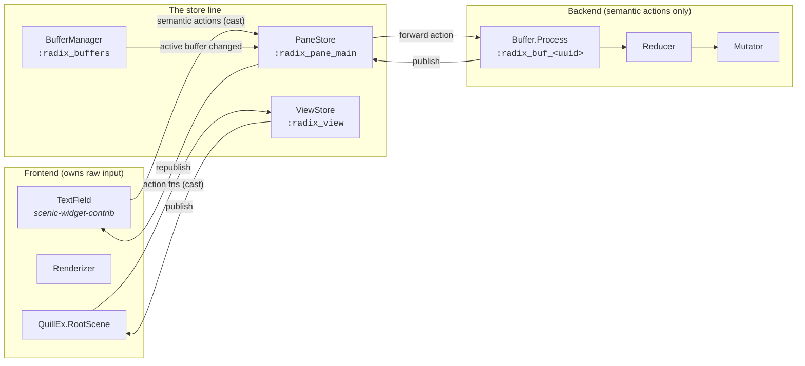
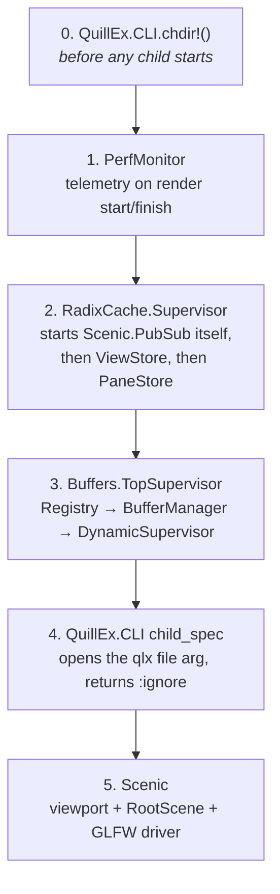
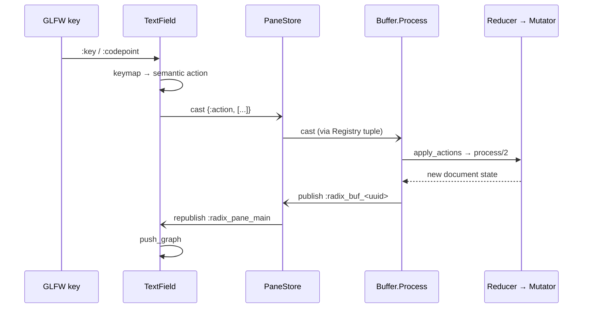

# Quillex — A Tour of the Codebase

> *"Simplicity is the highest goal, achievable when you have overcome all
> difficulties. After one has played a vast quantity of notes and more notes,
> it is simplicity that emerges as the crowning reward of art."*
> — Frédéric Chopin

That quote is the entire content of the first commit, May 5th, 2021. Five
years later, the architectural heart of this editor — the store layer that
every other part of the system is organised around — is still the smallest
thing in it. The quote turned out to be a design document.

This tour complements `ARCHITECTURE.md` (which owns the topology and flow
diagrams) rather than repeating it. It covers what that document doesn't:
the boot sequence and why its ordering is load-bearing, the backend's real
API surface, the rendering doctrine, the test estate, and the history still
visible in the strata of the repo. An appendix maps the current manual-QA
findings to the exact code responsible.

---

## 1. The shape of the thing

~12,400 lines of Elixir in `lib/`, ~36,000 in `test/`. That ratio is the first
thing to appreciate: this is a text editor that is mostly *test harness*, and
the harness drives a real GLFW window.

| Area | LOC | Role |
|---|---|---|
| `lib/gui/` | 5,836 | The frontend: one scene, its renderer, and the stores it reads |
| `lib/buffers/` | 2,665 | The document backend: process, reducer, mutator |
| `lib/utils/` | 2,060 | CLI, file operations, external-file sync, perf |
| `lib/search/` | 708 | Project-wide search: backends, globs, replace |
| `lib/api/` | 655 | The public contract |
| `lib/gui/radix_cache/` | **1,275** | The store layer — the centre of gravity |

Note where the store layer sits: *inside* `lib/gui/`, not beside it. That is
not where the doctrine would put it, and it is worth knowing before you go
looking for `lib/radix_cache/` and fail to find it.

The frontend is a single `Scenic.Scene` — `QuillEx.RootScene` — and
everything visible inside it is a reusable component from
`scenic-widget-contrib`. Quillex itself contains no widgets. That was not
true for most of its life; it is the result of the 2026 refactors, and it's
why the whole editor surface is now three lines of configuration (§5).



Only *semantic actions* cross the store line going right; only *published
snapshots* cross it coming left. No process on one side holds a pid from the
other. `ARCHITECTURE.md` states the three properties that make this work;
the rest of this tour shows where each one is enforced in code.

---

## 2. Boot — the order is the design

`lib/cli.ex` opens with a 25-line moduledoc whose thesis is that the boot
order *is* the whole design. It's right, and it's worth walking through
`QuillEx.App.start/2` (`lib/app.ex:9`) child by child, because every
position in this list is a decision:



- **`chdir!` runs before everything** because `ViewStore.init` seeds
  `file_nav_path: File.cwd!()` (`view_store.ex:75`). If the VM's cwd were
  still the project root instead of the user's shell directory, the file
  navigator would open in the wrong place forever after.
- **The stores start before Scenic** — and `RadixCache.Supervisor`
  (`lib/gui/radix_cache/supervisor.ex`) starts `Scenic.PubSub` *itself*.
  This is what the scenic fork exists for: upstream Scenic would try to
  start its own PubSub and crash; the fork skips it when one is already
  running. The stores must exist before any scene subscribes to them.
- **Child 4 is a fake process.** `QuillEx.CLI.child_spec` runs
  `start_link`, which opens the file passed to `qlx` and returns `:ignore`
  — it occupies a slot in the supervision order purely so the buffer exists
  before RootScene's `init` runs. A supervisor list used as a sequencing
  primitive.
- **`started_by_flamelex?/0`** (`app.ex:96`) drops children 5–6 entirely,
  so Flamelex can embed Quillex's backend headless. This escape hatch dates
  to a 2021 commit that reads *"I toyed with the idea of making a main
  executive process & accidentally started re-creating flamelex"* — the
  moment the two projects' relationship was settled.

---

## 3. The store layer — six stores

Every store is a GenServer that owns exactly one retained `Scenic.PubSub`
source, and every mutation funnels through one `publish` call. Source atoms
are minted in exactly one place — `Quillex.RadixCache.Sources`, 21 lines.

| Store | Source | Owns |
|---|---|---|
| `Buffer.Process` (×N) | `:radix_buf_<uuid>` | one document |
| `BufferManager` | `:radix_buffers` | buffer list, active buffer, dirty flags |
| `PaneStore` | `:radix_pane_main` | *which* document the main pane shows |
| `ViewStore` | `:radix_view` | settings, theme, file-nav, status message |
| `ProjectSearchStore` | `:radix_project_search` | project search: query, scope, results, dismissals |
| `HighlightStore` | `:radix_highlights` | token spans for the pane's document |

**`PaneStore` (`lib/gui/radix_cache/pane_store.ex`) is the most
conceptually interesting module in the repo.** It is an indirection layer:
the TextField subscribes to `:radix_pane_main` once, at creation, and never
learns which buffer it is showing. When the active buffer changes,
PaneStore — subscribed to `:radix_buffers` — does a delicate three-step at
`pane_store.ex:63-94`:

1. unsubscribe from the old buffer's source;
2. `get/1` the new buffer's retained value and republish it on the pane
   source **immediately**;
3. *then* subscribe to the new source.

The comment at `:83` explains why get-then-subscribe rather than just
subscribe: subscribing re-delivers the retained value anyway, so nothing
published in the gap is missed, and rendering the same snapshot twice is
idempotent. The payoff is stated at `qlx_root_scene_renderizer.ex:398`:
**switching buffers does not recreate the buffer pane.** In April 2026 the
spex suite had 17–20 failures, most traced to component churn on buffer
switch (`docs/claude_notes/franklin_known_failures_2026_04_22.md`); after
PaneStore it had 4.

**`ViewStore` (127 lines)** has two details worth savouring:

- The status-bar message auto-clears after 5 seconds — via a timer stamped
  with `make_ref()` (`view_store.ex:105`). A stale timer's ref no longer
  matches and is swallowed (`:118`), so a slow old clear can never erase a
  newer message. Sixteen lines for a bug most editors ship with.
- RootScene merges only a whitelist of keys from the store (`@view_keys` in
  `qlx_root_scene.ex`). The search and dialog flags live in the store but are
  deliberately *not* merged, because clobbering them mid-dialog would break
  in-flight choreography.

**`ProjectSearchStore` is the one store that subscribes to another's source.**
It follows `:radix_pane_main`, so editing a file the search results are showing
re-searches *that buffer*, debounced — the pane stays live for open documents
without ever walking the tree on a keystroke.

---

## 4. A keystroke, end to end



Note what is absent: **RootScene is not in the hot path.** Neither is the
TabBar — `buffer_process.ex:82` casts a metadata update only when `dirty?`
or `name` *transitions*, so the tab's dirty dot is reactive without a
buffer-list publish per keystroke.

There is a second, slower path for app-level shortcuts (Ctrl+N/O/W, etc.):
RootScene handles the key, calls a store action function, and re-renders
when the store publishes back. And one deliberate exception:
**Ctrl+F/Ctrl+H are not in RootScene's `handle_input` at all**
(`qlx_root_scene.ex:76-86`) — they arrive via TextField `cast_parent`,
because handling them in both places double-fired and crashed the scene.
The comment explaining this is the scar tissue of that debugging session.

### The backend's real API: the Reducer's action vocabulary

`Quillex.Buffer.Process.Reducer` (`buffer_reducer.ex`, 652 lines, ~55
`process/2` clauses) is the true API surface of the backend — the complete
vocabulary of things that can happen to a document: undo/redo, search and
replace, cursor movement, selection, insert/delete, yank/cut/paste, word
navigation, save. Its undo discipline is a single rule enforced in one
place: `push_undo/1` is called *before* modifying, and clears the redo
stack.

Below it, `Mutator` (`buffer_mutator.ex`, 561 lines) is pure text surgery
on a list of strings — `insert_text/3`, `delete_char_before_cursor/2`,
`select_all/1` — with no knowledge of actions or undo. The split means the
Mutator is trivially property-testable, and `test/property/` does exactly
that with StreamData.

*(A historical footnote: the Mutator's module name is
`Quillex.GUI.Components.BufferPane.Mutator`, though it lives in the backend
and there has been no BufferPane component since the TextField migration.
The name is a fossil — see §8.)*

---

## 5. Rendering — one scene, six children, and a z-order doctrine

`Renderizer.render/4` (`qlx_root_scene_renderizer.ex:46`) is a pure
`(graph, old_state, new_state) → graph` function. Layout is nested
`Widgex.Frame.v_split`/`h_split`: 35px top bar, optional search bar,
optional 250px file-nav sidebar, optional 24px status bar, and the buffer
pane gets whatever remains.

The doctrine (`:87-111`, expanded in `AGENTS.md`): Scenic renders in
add-order, and a deleted-then-recreated primitive lands at the *end* of the
graph — i.e., on top. So when layout *structure* changes, the Renderizer
deletes **all six children** and rebuilds bottom-to-top; when it doesn't,
the incremental `maybe_update_*` branch touches nothing structural and
z-order is preserved by inaction. `needs_buffer_pane_recreation?/2` (`:396`)
is the gatekeeper predicate — settings, layout visibility, status-bar
appearance. Deliberately **not** buffer switch (that's PaneStore's job, §3).

And the editor surface itself — the whole reason this app exists — is now
three keys at `do_create_buffer_pane/3` (`:421`):

```elixir
input_mode: :store_backed,
dispatch:   Quillex.RadixCache.PaneStore,
source:     Quillex.RadixCache.PaneStore.source()
```

Everything else — text, cursor, selection, scrolling, the line-number
gutter — is `ScenicWidgets.TextField`, 4,505 lines in
`scenic-widget-contrib`, reusable by any app that implements the same
three-key contract. Quillex's editor pane is now *configuration*.

**A road not yet taken:** `ScenicDiff` (the sibling project, and the
declarative-rendering pattern the global CLAUDE.md describes) is referenced
**nowhere** in Quillex or scenic-widget-contrib. The Renderizer's
`needs_*_recreation?` predicates are its hand-rolled ancestor. If ScenicDiff
matures, the Renderizer is the code it would replace.

---

## 6. The dependency constellation

Quillex is the anchor tenant of a neighbourhood of sibling projects, all
path deps, all co-developed:

| Sibling | What Quillex takes from it |
|---|---|
| `../scenic` (fork) | PubSub boot-skip (§2); the Semantic Scene Model that spex queries; scissor hit-testing fix; `Scenic.DevTools` |
| `../scenic_driver_local` (fork) | GLFW window/driver |
| `../scenic-widget-contrib` | TextField, TabBar, IconMenu, SearchBar, SideNav, FilePicker, ConfirmDialog, and the `Widgex.*` layout/scroll primitives |
| `../spex` (`sexy_spex`) | the spex DSL and `mix spex` |
| `scenic_mcp` (git) | `Probes.send_text/send_keys`, `Query.text_visible?` — spex's hands and eyes |
| `boundary` (hex) | compile-time module-dependency enforcement |

Three compile-time subtleties in `mix.exs` that will bite anyone who
doesn't know them: the `:spex` compiler is omitted in `:prod` (`:35`)
because it ships with a test-only dep; `:scenic_mcp` joins
`extra_applications` only in dev/test (`:48`); and `releases/0` (`:23`)
builds a self-contained ERTS bundle.

---

## 7. The test estate — the biggest thing in the repo

Two parallel systems, and together they outweigh `lib/` three to one.

**ExUnit** (~5,000 LOC, `mix test`) mirrors `lib/`: `test/reducers/` is the
largest at 1,586 lines, plus property tests over the Mutator, GUI tests,
buffer tests. Spinoza's *Ethics* Part I (81KB, in `biblio/` and
`test/support/`) is the standard large-file corpus — scenarios in the
integration spex are literally named "Find in Spinoza."

**Spex** (~58 files, ~16,000 LOC, `scripts/run_spex_quiet.sh`) drives a **real
GLFW window**. Each spex is a `spex … scenario … given_/when_/then_` block. The
assertions are the remarkable part:
`Quillex.TestHelpers.ScriptInspector` reads Scenic's *script table* and
reconstructs the on-screen text sorted by (y, x) — verifying
pixels-as-rendered, not internal state.

Boundary enforcement makes the honesty structural: `Quillex.Spex` declares
`deps: [Quillex.TestHelpers, ScenicMcp, SexySpex]`, so a spex *cannot
compile* if it reaches into Quillex internals. `TestHelpers.FileOpener`
exists precisely because calling into RootScene from a spex would be a
boundary violation.

And then there is **`tools/window_pinner.c`** — 200 lines of hand-written
X11 EWMH C whose sole purpose is keeping test windows off the desktop
you're working on. `mix run_spex` SIGTERMs it rather than closing its port,
and the docstring explains why: the pinner blocks in `XNextEvent` and would
never notice a closed pipe. A text editor with a bespoke X11 daemon in its
test tooling is a project that takes its test ergonomics seriously.

`test/old_spex/` — 55 files of retired debug scenarios
(`final_debug_spex.exs`…) — is the archaeological layer of a hard debugging
era, kept rather than deleted.

**Scenarios used to share state deliberately, in sequence, like a user
session — and it was a mistake.** `07_integration_v1_spex.exs` held fifteen
scenarios that inherited each other's buffers, and it failed a *different,
shifting* set of them on identical code, one to six per run. That made it
useless as a regression signal: a real break and ordinary noise looked exactly
alike, and it once cost a rebuild of the TabBar renderer under a diagnosis that
was simply wrong. It is now seven per-feature files (`50_`–`56_`), each
starting from `Quillex.TestHelpers.Integration.fresh_editor!/0`, and they run
green together, repeatedly. Two files still carry the disease —
`04_view_settings` and `30_clipboard` — and are named in the roadmap.

The lesson generalises to two rules the newer spex follow. **Own your setup**:
a scenario that inherits what the last one left open fails for reasons that
have nothing to do with what it is testing. **Never hardcode a coordinate**:
an open file navigator moves the editor pane 250px right, so a fixed click
lands in the sidebar — derive every point from
`SemanticHelpers.get_buffer_frame()`.

---

## 8. Archaeology — reading the strata

The repo preserves its own history unusually well, and it rewards reading:

- **The Fluxus fossil.** `lib/fluxus/` is named for an architecture that no
  longer exists. The original — EventBus topics, `ActionListener`,
  `UserInputListener`, a `RadixStore` — survives intact in
  `git_garbage/fluxus/` (718 lines, deliberately tracked), where
  `user_input_listener.ex:28` reads `raise "... you have died."` The word
  *Radix* survived the migration to the PubSub store architecture; the
  machinery didn't. The three files still in `lib/fluxus/` are innocent
  bystanders that never moved out.
- **"Franklin"** (CLAUDE.md, branch names, three commit prefixes, one
  failure doc) is a working title for a development era, not a module.
- **Failure documentation as a genre.**
  `docs/claude_notes/franklin_known_failures_2026_04_22.md` tracks four
  deliberately-deferred failures with provenance, and retro sections record
  which rows closed *as a side effect* of the PaneStore refactor.
  `docs/bugs/` numbers its bug write-ups. There is a formal decision record
  about whether to commit a six-line config file (the answer was no).
- **Comments that are essays.** The best documentation is inline, and each
  one is the scar of a specific bug: `cli.ex:11-24` on boot order;
  `buffer_pane_state.ex:39-47` on why font metrics come from
  `Scenic.Assets.Static.meta/1` and not a path (*"a path assumes the source
  tree is still sitting where it was at compile time, which is false the
  moment `qlx` adopts the shell's working directory, and false again inside
  a release"*); `pane_store.ex:83` on subscribe-after-get;
  `run_spex.ex:116-126` on SIGTERM.
- **`bin/qlx`** deserves its reputation as the best-commented file in the
  repo: it absolutises path arguments *before* leaving the user's
  directory (so `qlx new-file.txt` works for files that don't exist yet),
  probes for a running instance with bash's built-in `/dev/tcp` rather than
  shelling out, defaults to `MIX_ENV=prod` because *"a text editor you
  handed to someone else has no business listening on a socket,"* and
  `setsid`s the app so it outlives the terminal.

The through-line of the whole history: **every major refactor moved code
out of Quillex.** The GUI shrank into scenic-widget-contrib, input handling
shrank into TextField, buffer-switch choreography shrank into 116 lines of
PaneStore. What remains is close to the minimum: a boot sequence, a store
layer, a renderer, and a document engine. The first commit knew where this
was going.

---

## Appendix A — Manual-QA findings, mapped to code

From the 2026-07-31 QA notes. Ordered by severity; every item is pinned to
the responsible code.

### A1. Enter inserts a newline AND opens a new buffer  — *input bug*

**Cause found.** Both `SideNav` and `TextField` request keyboard input
globally, but only one of them is polite about it. TextField gates every
`:key`/`:codepoint` on `state.focused and state.editable`
(`text_field.ex:259-268` — the comment reads *"prevents unfocused/read-only
TextFields from stealing input"*). SideNav has **no such gate**: it
requests `[:key]` at `side_nav.ex:104` and its `:key_enter` handler
(`:365`) fires unconditionally — navigating and running the item's action
callback (→ open file → new buffer) even while the TextField owns focus.
**Fix direction:** give SideNav the same `focused` gate TextField already
has, wired to the focus tracking RootScene/spex 18 already exercise.

### A2. Scrolling the side pane also scrolls the text pane — *input bug*

**Cause found.** Same family, opposite direction. TextField's focus gate
covers keyboard only — its catch-all clause processes mouse/scroll
unconditionally (`text_field.ex:271-274`, comment: *"Mouse/scroll input -
always process"*), while SideNav receives scroll routed from RootScene via
`handle_put` (`side_nav.ex:174-175`). A scroll over the sidebar is
delivered to both. **Fix direction:** scroll is positional — bound-check it
against the pane frame (RootScene knows both frames) or move TextField to
positional delivery, leaning on the fork's scissor hit-testing fix.

### A3. Window boots smaller than the internal layout; resize doesn't reflow ✅ *fixed 2026-07-31*

**Root cause:** `needs_buffer_pane_recreation?/2` didn't consider frame
changes, so `:reshape` took the incremental render branch and children kept
their old geometry. Fixed by adding `frame_changed` to the predicate;
scroll position now also survives the rebuild. See
`21_viewport_resize_spex.exs`. Original analysis below.

**Partially located.** The viewport is created at a fixed
`@default_resolution {1680, 1005}` (`app.ex:50`) regardless of what the
window manager actually grants. A `:reshape` handler *does* exist
(`qlx_root_scene.ex:172`, building a new `Widgex.Frame` at `:188` and
threading `:_restore_cursor` / `:_restore_first_visible_line` through the
recreation) — so either it isn't firing on live resize or it isn't
propagating to all six children. Needs a live-window session to verify
which. The hidden horizontal scrollbar is a symptom of the same mismatch.
*(You asked whether we're "not using Widgex Frame here" — we are; the
frames just get computed from the wrong initial size.)*

### A4. Save-dialog filename input is a hand-rolled textbox

**Cause found.** In save mode `FilePicker` requests raw `:codepoint` input
and renders the filename itself (`file_picker.ex:80-101`) — it predates the
TextField `:store_backed` contract, hence the cursor misalignment. **Fix
direction:** embed a single-line TextField, which since the July refactor
is exactly what it's for.

### A5. Text-pane border: want left+right only, no top/bottom ✅ *fixed 2026-07-31*

TextField now takes `border_sides:` (default all four); Quillex passes
`[:left, :right]`. Original analysis below.

**Cause found.** TextField draws a full 1px `stroke` rect on all four sides
(`renderer.ex:105-112`, `id: :border`; focus-colour update at `:682-692`).
The right edge is currently invisible only because of A3 (the pane extends
past the window — you confirmed the line appears when widening). **Fix
direction:** make border sides configurable on TextField
(`border: [:left, :right]`), then Quillex passes its preference.

### A6. Side-nav polish: auto-fading scrollbar, larger configurable font

Enhancement, not bug. Both belong in `side_nav/` in scenic-widget-contrib —
font size as a component option (matching the text pane's), scrollbar
opacity animated on scroll activity. Fits the genericization doctrine:
build it configurable in contrib, configure it in Quillex.

### A7. Help → About does nothing ✅ *fixed 2026-07-31*

Was a stub: `qlx_root_scene.ex` matched `"about"` and only logged a line.
Now shows an About dialog (ConfirmDialog with a single OK button — 
`PopupModal` in contrib turned out to be an empty 0-line stub) with the
version, the Chopin quote from commit #1, and the GitHub URL. Escape or OK
dismisses and refocuses the editor. A future custom splash banner is noted
in the roadmap.

### A8. Buffer pane updating very slowly ✅ *(root cause found 2026-08-01)*

Reported live 2026-07-31. GPU render was always in budget (~10ms — see
`24_performance_budget_spex.exs`); the real story was **the editor got
slower the longer it ran**, found via the spex suite exhibiting the same
in-run degradation (late-run scenarios flaking on lag, failure sets
shifting run to run). Two compounding defects in the scenic fork:

1. **Ghost rows accumulated forever** — `put_graph` inserted
   semantic/scene-script rows for every scene, and nothing deleted them
   when scenes died. A session's every dead component grew the tables.
2. **Every push paid for every row** — `put_graph` recomputed the full
   scene-script hierarchy (`tab2list` all graphs, recompute parent/child/
   depth, reinsert everything) **on every content push**, i.e. on every
   keystroke. Cost grew with the accumulated table.

Together: per-keystroke latency growing with session age — "the pane is
updating very very slowly." Both fixed in the fork: scene death and
`del_graph` purge the rows (also ending the spex suite's order-dependent
flake class — stale semantic entries had been shadowing live ones for
test readers); hierarchy now recomputes only when the graph *set*
changes. A stale-scroll-on-buffer-switch bug was also found and fixed the
same night (real, but secondary). Validation: the failing spex trio went
0-failure immediately after the fix.

### A9. Cursor could sit outside the document ✅ *(found & fixed 2026-08-01)*

Surfaced by a crash in a spex log, not by a QA note:
`{:delete, :before_cursor}` failing with `FunctionClauseError` in
`String.split_at/2`. `Mutator.move_cursor/2` accepted any `{line, col}`
with `line >= 1` and **no upper bound**, so the cursor could be placed past
the end of the buffer; the next edit then split a `nil` line. Reachable in
normal use: clicking below the last line, or carrying a line-26 cursor onto
a 3-line buffer during a switch. Fixed by clamping into the document —
which is also what users expect from every editor.

### A14. A spex clicking at a fixed x could hit the sidebar ✅ *(fixed 2026-08-01)*

Not an app bug, but the cause of months of "the click did nothing" flakes.
With the file navigator open the editor pane starts at **x=250**, so any
test clicking at a hardcoded x=120 landed in the SIDEBAR — the cursor
simply stayed where typing left it. Intermittent because it depended on
whether an earlier spex left the navigator open. Fixed three ways: click
coordinates derive from the pane's live semantic frame,
`ViewStore.close_file_nav/0` now exists (the API could open and toggle but
not close), and every spex resets its LAYOUT (overlays + navigator) in
`setup_all` without touching buffers — a full buffer reset breaks files
that deliberately build on documents opened earlier.

### A10. Opening Find could corrupt the open document ✅ *(found & fixed 2026-08-01)*

The worst bug of the whole pass, and it was never reported by hand — the
spex suite caught it. Showing the search bar changed the layout, which
**recreated the buffer pane**, but the outgoing TextField stayed alive and
focused for a moment afterwards. Keystrokes in that window were applied to
the *document*: typing a search query inserted its characters into the
file, and the 50 backspaces used to clear the query field deleted 14
characters from line 1 of the open file (`"PART I. CONCERNING GOD."` →
`"PART I. C"`). Fixed twice over: blur the pane *before* the re-render, and
then more fundamentally — **the pane is never recreated at all** now; it
moves and resizes in place for every layout change, keeping its process,
input registration, focus, cursor and scroll. Related: RootScene's
document-mutating shortcuts (Ctrl+D, Ctrl+Home/End, PgUp/PgDn) are now
gated on overlay focus, so Ctrl+D mid-search no longer deletes a line of
your file.

### A12. Large files were slow to render ✅ *(fixed 2026-08-01)*

`render_text_lines` built a text primitive for **every line in the
document** — over a thousand for the Spinoza fixture — on every full
render. Now only the visible range is drawn (plus a small buffer), with
each line still at its absolute y so the scroll translate is unchanged.
**Average render 10.4ms → 1.75ms; worst case 17.8ms → 3.4ms; zero slow
frames.** Three constraints are load-bearing and documented at the call
sites: compare visible windows using geometry only (never re-wrap the
document per render), modify primitives inside the window but rebuild when
it moves, and clamp the window's start or the view blanks at end-of-file.

### A13. Word wrap made the end of a document unreachable ✅ *(fixed 2026-08-01)*

`ensure_cursor_visible` computed its scroll target from the **source** line
number. With wrapping on, a line occupies several display rows, so Ctrl+End
never scrolled far enough and the last lines could not be reached. Now uses
the display line via `Renderer.source_to_display_cursor/2`. Found only
because virtualisation made the covering test meaningful — previously every
line was drawn, so the assertion passed regardless of scroll position.

### A11. Clicking a blank or short line does nothing ✅ *(fixed 2026-08-01)*

Superseded: the geometric guess was replaced by an explicit `overlay_open`
flag that the host sets when a dropdown owns the pointer (IconMenu now
emits `{:dropdown_opened, id}` / `{:dropdown_closed}`). Clicks past the end
of short and blank lines place the cursor again. The flag is cleared from
three independent places so a single lost message cannot latch it on — while
latched, every click on the editor is ignored.

*Original limitation, for context:*

Clicks landing to the right of a line's text are discarded by TextField's
`store_backed_overlay_click?` heuristic, so the whitespace right of short
lines — and all of a blank line between paragraphs — is dead to the mouse.
The heuristic exists to stop clicks meant for a dropdown (rendered above
the pane) from also moving the cursor underneath. Removing it was tried and
**reverted**: it let File-menu clicks move the document cursor, which broke
cursor preservation across buffer switches. The correct fix is overlay-aware
input (the host telling the component when an overlay owns the pointer)
rather than geometric guessing — deferred past 1.0.

**Pattern worth noticing:** A1, A2, A4, A5 are all in scenic-widget-contrib,
not Quillex — the QA pass is effectively stress-testing the newly
genericised components. A1+A2 share one root cause (global input
requests vs. focus/position routing) and were fixed as one piece of
work (see `19_input_focus_routing_spex.exs`).
