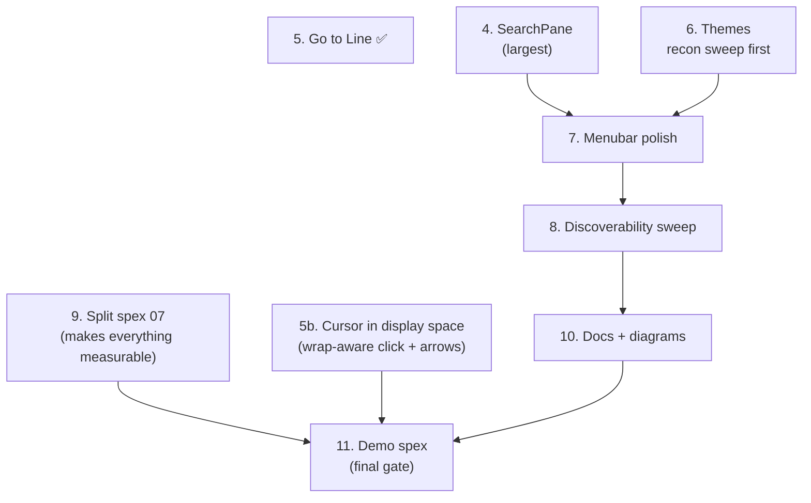
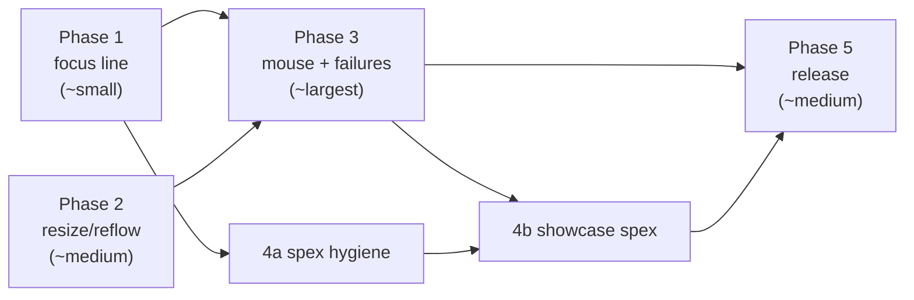

# Quillex 1.0 — Action Plan

*Drafted 2026-07-31, from: the codebase tour (`docs/CODEBASE_TOUR.md`), the
2026-07-31 manual-QA notes, `TODO_TEXT_EDITOR_FEATURES.md`, and
`docs/claude_notes/franklin_known_failures_2026_04_22.md`.*
*Part II added 2026-08-17.*

> **Current work is [Part II — The Product Pass](#part-ii--the-product-pass-2026-08-17).**
> Phases 1–5 below are the original engineering gates (G1–G4); they are
> historical and largely closed. Read Part II first.

## What 1.0 means

Quillex 1.0 is **the `qlx` command you'd happily put on someone else's
machine**: open a file, edit with keyboard *and mouse*, find/replace, save,
close — with no input leaking between panes, a window that reflows when
resized, and a green test suite whose spex files are themselves part of the
showcase. Not in 1.0: minimap, multiple cursors.

*Scope correction, 2026-08-17: this line originally also deferred **syntax
highlighting** and **regex search**. Both shipped — structural highlighting
(weight/slant/underline, no palette) in 104c849, and `:regex` /
`:case_sensitive` search options in 605fc59.*

The definition of done, as four gates:

1. **G1 — Zero known input-routing bugs.** No double-delivery anywhere.
2. **G2 — `mix spex` fully green**, including the four known failures, with
   the 07 monolith split so no scenario depends on another file's leftovers.
3. **G3 — Mouse editing works**: click to position (on the correct line),
   drag to select, double-click word.
4. **G4 — A `MIX_ENV=prod` release that boots, edits, and saves on a
   machine that has never seen the source tree.**

### Gate ledger (updated 2026-07-31, late session)

| Gate | State | Evidence / remaining |
|---|---|---|
| G1 | ✅ believed done | Focus line (Ph.1), reflow (Ph.2); regression spex 19/21 green. Live confirmation by a human pass still wanted. |
| G2 | ✅ **116/0 × 3 consecutive** (2026-08-01) | Closed. The last two causes were found by measurement, not guesswork: (1) the **file navigator left open by an earlier spex** shifts the editor pane 250px right, so spex clicking at a fixed x hit the SIDEBAR and the click never reached the document — fixed by deriving click coords from the pane's live frame, adding `ViewStore.close_file_nav/0` (the API could open and toggle but not close), and a layout-only reset in every spex; (2) **search-bar keystrokes could still reach the document** — focus is granted/revoked asynchronously, so blurring before the re-render narrowed the window without closing it. There is now an independent keyboard gate: while an overlay owns the keyboard the editor ignores key input regardless of its own focus flag, and `:focus` clears that gate so it can never latch. *Earlier ledger detail:*

| — | *(historical)* | Latest pair before closure: **116/0** then **116/1**. Current build = recreation + virtualised rendering, the most stable measured. Virtualisation also SHORTENS the recreation window (a new pane now renders a screenful, not a document), which is why the numbers improved. Remaining: the typing-after-search-close scenario, i.e. that window. Closing it fully means keeping the pane alive — implemented, and blocked on one contained item: a surviving pane keeps its own cursor while a recreated one is rebuilt from the buffer's, so the pane's cursor must be made to follow the store strictly on every publish. Everything else it needed is already done.

**Virtualisation SHIPPED (2026-08-01, authorised) — and it is the biggest
win of the pass.** `render_text_lines` and the line-number gutter now draw
only the visible range (plus `viewport_buffer_lines` either side).
Measured on the perf spex: **average render 10.4ms → 1.75ms, max 17.8ms →
3.4ms, zero slow frames.** This removes the large-file ceiling behind A8.
Design notes worth keeping:
- The window comparison uses scroll offset + frame geometry ONLY. Calling
  `wrap_lines` for a line count re-wraps the document every render and
  stalls the component so badly that scroll input stops being serviced.
- Line edits modify primitives IN the window and rebuild only when the
  window moves or the line count changes. Rebuilding per keystroke is
  O(document) and cannot keep up with typing; modifying alone silently
  skips off-screen lines (their primitives do not exist).
- The window's START must be clamped to the document, or scrolling to the
  end selects nothing and the view goes blank.
- It exposed a real bug: `ensure_cursor_visible` computed scroll targets
  from SOURCE line numbers, so **with word wrap on the end of a document
  was unreachable**. Now uses the display line. That test had been passing
  vacuously — every line was drawn, so scroll position never mattered.

*Earlier attempt notes (superseded):*
Rendering only the visible line range was implemented end to end
(`State.visible_display_range/2` remains in the codebase, ready). Two
lessons, both worth keeping:
1. The window comparison must use scroll offset + frame geometry ONLY.
   Calling `wrap_lines` to get the line count re-wraps the whole document
   on every render — it stalled the component so badly that scroll input
   stopped being serviced.
2. The blocker: the *incremental* update paths (`update_lines_if_changed`
   and friends) address `{:text_line, n}` primitives directly, so for any
   line outside the rendered window they silently no-op (their `Graph.modify`
   is wrapped in a rescue). **Virtualisation requires those paths to become
   window-aware first** — rebuild the content area when an edit touches a
   line outside the window, rather than modifying a primitive that isn't
   there. That is the next concrete step, and it is a contained one.

**The remaining cause is known and scoped.** Every run's failures are a *different* scenario failing the same way: an interaction (a click, a keystroke) does not take effect. That is the pane-recreation window — a layout change destroys the TextField and builds a new one, and input arriving in between reaches a dying instance or none. The fix is to keep the pane alive across layout changes (implemented and proven: see `update_or_create_buffer_pane/4`, currently unwired). It is blocked on one prerequisite: **`render_text_lines` builds a text primitive for every line in the document**, so an in-place rebuild of an 81KB file blocks the component for seconds and times out the scene's next synchronous call. Virtualise line rendering to the visible range (already on the TODO as "large file handling"), then wire the in-place path, and this class disappears — along with the large-file sluggishness behind A8.

*Earlier ledger detail:* Across ~35 runs the rest land at 1–6 failures with a *shifting* failure set, on identical code; targeted subsets run green repeatedly (19/0, 22/0, 31/0). Every reproducible cause found was fixed (list below); the residue is timing under sustained load, where an interaction lands during a transient window and the scenario asserts before the app settles. **The one structural fix left, and the right next step:** overlay-aware positional input — the host telling components when an overlay owns the pointer, instead of TextField guessing from geometry (see its `store_backed_overlay_click?` note). That would remove both the blank-line dead zone and the last class of click misrouting. Deliberately deferred rather than attempted late: an earlier attempt at exactly this, made hastily, caused a regression (dropdown clicks moving the document cursor). Detail below. Root causes, not waits: **five scenic-fork defects** (ghost semantic rows never purged on scene death; per-push hierarchy recompute; driver-side script leak; missing `del_scripts` on the death path; positional input delivered with raw GLOBAL coords on transform-miss — ~676×/run), **one app bug** (File→Open duplicated already-open buffers), **a second app bug** (cursor could be placed outside the document — `move_cursor` had no upper bound, so the next edit crashed splitting a `nil` line; now clamped, see tour A9), **one instrumentation bug** (published semantic frame went stale because `semantic_changed?` ignored frame changes), and **four test-design defects** (unverified File→New; heuristic reads; conformance isolation; tab-click switches with no deterministic fallback) (unverified File→New silently redirected whole scenarios to the wrong buffer — the single largest flake source; reads using a "latest text_buffer" heuristic instead of the editor pane; the conformance spex needing buffer isolation). Re-run to confirm stability before trusting it. |
| G3 | ✅ believed done | Click-to-position (aligned row model), drag select, double-click word, click-clears-selection, thumb drag, shift+scroll — all green in dedicated spex. Shift+click extend unverified. |
| G4 | ✅ machine-verified | Release builds (83MB, v0.1.2). **Full edit-and-save verification 2026-08-01:** the bundle was *copied outside the build tree*, booted from there with `QLX_TARGET`, the target file appeared as a buffer, an insert action was applied through the real buffer engine, and `save_as` wrote the correct content to disk (verified from the shell). Test rig: the copy's `env.sh` temporarily re-enabled distribution for `rpc` — the shipped artifact keeps distribution off. Honest residue: same physical machine (OS/GL variance untested) — a 5-minute human pass on other hardware remains the final sign-off. |

---

## Phase 1 — The focus line (fixes QA A1 + A2 as one piece of work)

The two input bugs share one root cause: components consume global input
without asking who has focus. TextField already models this correctly
(`text_field.ex:259-268` gates keyboard on `focused and editable`); the fix
is to finish the thought everywhere else.

| Step | Where | What | Status |
|---|---|---|---|
| 1.1 | scenic-widget-contrib `side_nav.ex` | Add `focused` to SideNav state; gate **all** `{:key, _}` handlers on it (previously `:key_enter` fired unconditionally → the phantom new-buffer bug). SideNav also self-focuses on row/chevron clicks and accepts `:focus`/`:blur` via `handle_put` (TextField's contract). | ✅ 2026-07-31 |
| 1.2 | `qlx_root_scene.ex` | RootScene as focus arbiter: clicks below the top bar route focus/blur to `:file_nav` vs `:buffer_pane` by x-position (skipped while a dialog is open); opening a file from the nav hands focus back to the editor. | ✅ 2026-07-31 |
| 1.3 | scenic-widget-contrib `text_field.ex` | Scroll bound-checked against the component frame (`point_in_frame?/3`) before processing — fixes the sidebar-scroll-scrolls-textpane leak for every future consumer, not just Quillex. | ✅ 2026-07-31 |
| 1.4 | `19_input_focus_routing_spex.exs` | Regression scenarios (fills the vacant 19 slot): (a) file-nav open + Down/Enter in textpane → newline only, typing continuity asserted; (b) 10× scroll over sidebar with Spinoza open → top of file still visible. | ✅ 2026-07-31 |

*Verified: spex 19 (new, 2 tests), 02, 10, 18 — all green, 11 tests 0
failures. Bonus landed the same day: **Help → About dialog** (QA A7) —
version, Chopin quote, GitHub link via ConfirmDialog; `popup_modal.ex`
turned out to be an empty stub, so a proper splash banner is now a 3.6
polish item.*

*Also unblocks:* the rotating 07 failure ("07-internal state interference")
is plausibly this same class of leak; re-run the suite after 1.3 before
debugging it separately.

## Phase 2 — The window is the layout (QA A3 + A5)

| Step | Where | What | Status |
|---|---|---|---|
| 2.1 | `app.ex` | Resolved via 2.2: the app now accepts what the WM grants — the driver's initial `:reshape` reflows the whole layout to the granted size. *Verify once on a live WM smaller than 1680×1005.* | ✅ 2026-07-31 |
| 2.2 | `qlx_root_scene_renderizer.ex` | **Root cause found**: `needs_buffer_pane_recreation?/2` never considered the frame, so reshape took the incremental branch and every child kept its old geometry. Added `frame_changed` to the predicate → full bottom-to-top rebuild; reshape handler now also threads `_restore_first_visible_line` (scroll preservation, same as word-wrap toggle). | ✅ 2026-07-31 |
| 2.3 | scenic-widget-contrib `renderer.ex` | Border sides are a TextField option (`border_sides:`, default all four) rendered as per-side lines under the `:border` group (focus recolour still works via one `Graph.modify`). Quillex passes `[:left, :right]` per the QA aesthetic call. | ✅ 2026-07-31 |
| 2.4 | `21_viewport_resize_spex.exs` | Resize spex: injects `{:viewport, {:reshape, _}}` via new boundary-exported `TestHelpers.ViewportResizer`; asserts content/cursor/typing survive a shrink and the top bar re-registers at the new geometry. | ✅ 2026-07-31 |

*Verified: spex 21 (new), 18, 19 green. Full suite: 109 tests, 5 failures —
the 3 documented 07 baseline failures, plus 11 and 17 which **pass in
isolation** (order-dependent flakiness → logged as evidence for the 4a
`spex_stability` tooling item). Baseline failure "typing after search
close" (3.4) passed this run — likely fixed by Phase 1's focus arbiter;
confirm before ticking.*

## Phase 3 — Mouse editing + the known failures (G2 + G3 converge)

Three of the four known failures are real app bugs, and two are
mouse-related — the same work as the TODO's top "Discussed / In Queue"
item. Do them as one arc:

| Step | What | Status |
|---|---|---|
| 3.1 | **Click positions cursor on the correct line** — root cause measured empirically: three vertical models disagreed (text baseline at `n*lh`, cursor block at `(n-1)*lh+4`, click rows at `(n-1)*lh`). Click math now aligns with the cursor block (−4 offset in `click_to_cursor` and the overlay filter). Also established: input coords arrive already transformed to pane-local space. Regression home: `23_click_cursor_spex.exs`. | ✅ 2026-07-31 |
| 3.2 | **Drag to select, double-click word, click-clears-selection** — the machinery already existed (`text_drag` in TextField); the monolith scenarios were aiming at the top bar (written for a local-coords model that never matched reality). With corrected coordinates all three pass. Shift+click extend still unverified. | ✅ (verify shift+click) |
| 3.3 | **Shift+Scroll horizontal** — mechanism verified working end-to-end (shift tracked → axes swapped → offset moves → semantic reports it). The monolith failure was focus-dependence: shift tracking is gated on keyboard focus, which 20 prior stateful scenarios can't guarantee. Extracted to `22_scrollbar_drag_spex.exs` with a focus-guaranteed setup. Scrollbar-thumb drag from the same spex still fails — next candidate: thumb hit-test vs the semantic-frame-derived grab point (see 22's log trail). | ◐ shift+scroll ✅, thumb drag open |
| 3.4 | **Typing after search close** — known-failure #2 (07:572): focus doesn't return to the buffer pane when the search bar closes. Related to the Phase 1 focus arbiter — likely trivial after 1.2. |
| 3.5 | **Split `07_integration_v1_spex.exs`** into per-feature files, each owning its state setup. **Started 2026-07-31**: the three chronically flaky scenarios (click-cursor, thumb-drag, shift+scroll) extracted to 22/23 with self-contained, focus-guaranteed setups. Two structural lessons now encoded in the new files: (a) never hardcode window-size-dependent coordinates — the WM may grant less than requested, the layout reflows, and `ViewPort.info` reports only the *configured* size; use `SemanticHelpers.get_buffer_frame()` (TextField now publishes its actual frame in semantic metadata); (b) a scenario must prove its own preconditions (focus, typed text visible) before asserting. Also learned: 07 assumes near-boot state — never run other spex before it. **Promoted and re-evidenced 2026-08-17 — see Part II item 9.** | ◐ started |
| 3.6 | Small-but-1.0-worthy TODO items. **Audited 2026-07-31, the TODO was stale**: Select All (Ctrl+A → `:select_all`) and auto-indent on newline (`{:newline, :at_cursor}` extracts + applies leading whitespace, reducer-tested) were **already implemented** ✅. **Line:col indicator** ✅ implemented as `ScenicWidgets.CursorPosLabel` — a ~100-line contrib component that just subscribes to the pane source (the store line in miniature; RootScene uninvolved after creation), slotted in the top bar between tabs and icon menu. **About splash** ✅ 2026-07-31 (late): `ScenicWidgets.PopupModal` implemented (dimmed overlay, centred panel, Escape/Enter/OK dismiss, `{:popup_modal_response, id, action}` contract) — the About box now shows the full Chopin quote from commit #1 with the project link; verified by `26_about_dialog_spex.exs` (2 scenarios green, including focus return on dismiss). **3.6 complete.** |

## Phase 4 — The spex suite as a showcase

The suite is 9,420 lines driving a real GLFW window and asserting on
*reconstructed rendered text* — that's already rare. Two workstreams: make
it tidy, then make it remarkable.

**4a. Hygiene**

*2026-07-31 late session — the flake class fell.* Diagnostics dumped the
semantic table mid-failure and found **six ghost text_buffer rows from
dead TextField instances of earlier scenarios** shadowing the live one
("latest by graph timestamp" happily picks ghosts). Root cause in the
scenic fork: `put_graph` inserts semantic/scene-script rows, but neither
scene death nor `del_graph` ever deleted them. Fixed in the fork (the
`:DOWN` handler collects the dead pid's graph names from the script table
and purges all three tables; `del_graph` mirrors it). This is why waits
on cursor/content "timed out" randomly depending on run order — the
reader was consulting the dead. Every semantic-based helper in the suite
benefits.

- Renumber the duplicate `04_*` pair, fill or close the `19_` gap.
- Decide `test/old_spex/`'s fate (10,695 LOC): recommend archiving to a git
  tag + deleting from the working tree — the history is the museum.
- Make `scripts/run_spex_quiet.sh` the documented default in CLAUDE.md and
  README (full log to file, summary to terminal).
- A `spex_stability` tag + a rerun-on-failure pass in `mix run_spex` so
  "stable failure" vs "flaky" is measured by the tooling, not by memory.

**4b′. Performance budget (added 2026-07-31 after a "pane updating very
slowly" QA report)**

- `24_performance_budget_spex.exs` runs a typing+scrolling workload in
  Spinoza and asserts budgets from `Quillex.PerfMonitor` stats (via the
  boundary-exported `TestHelpers.Perf`): avg render < 16.7ms (live),
  avg/max handler < 33/500ms (dormant until instrumentation lands).
- Follow-up: instrument the hot path. PerfMonitor's `measure/2` has no
  call sites yet; the clean design is generic `:telemetry.execute` events
  from TextField's update path (contrib must not depend on Quillex) with
  PerfMonitor attaching to them. Then tighten the budgets from data.
- The dev build already logs a perf summary every 5s — when slowness is
  observed live, `Quillex.PerfMonitor.stats()` from IEx is the first diagnostic.
- **The in-run degradation story (closed out 2026-08-01, small hours).**
  Three findings, each real, found in sequence while chasing shifting
  suite flakes — together they are the full A8 answer:
  1. **Ghost semantic/scene-script rows** never deleted on scene death
     (fork `put_graph` inserted; nothing removed) — fixed in the `:DOWN`
     handler + `del_graph`.
  2. **Per-push hierarchy recompute over all graphs** — `put_graph`
     recomputed the whole scene-script hierarchy on *every content push*
     (every keystroke), cost growing with the table — now recomputes only
     when the graph SET changes.
  3. **Driver-side script leak** — the `:DOWN` path deleted dead scripts
     from the BEAM table but never cast `@del_scripts` to the drivers, so
     the C render side accumulated every dead scene's scripts for the
     session; the 24-spex tripwire caught GPU render degrading ~2×
     (10→17ms avg) by the end of a full run — fixed by notifying drivers
     in the death path.
  The PaneStore `[pane-latency]` telemetry (>100ms action→republish
  warning) stays as a permanent tripwire alongside spex 24's budgets.
- **Fork fix #5 — misrouted positional input (2026-08-01, small hours).**
  The "click lands one line off / click silently ignored" ghost, run to
  ground with buffer-side action tracing then quantified with a drop
  counter. When the ViewPort cannot resolve a requesting scene's
  transform, `do_requested_input` **delivered the event anyway with raw
  GLOBAL coordinates**; the receiver then ran local math on global values.
  **Measured at ~676 occurrences per suite run** — this is the COMMON case
  for any non-positional requester whenever a click hits some other
  component, not a rare race. Concretely: a menu-bar click at global y≈17
  is "inside" a full-height editor pane's local box, so the editor
  processed menu clicks as text clicks (TextField's `store_backed_overlay_click?`
  filter is an ad-hoc defense written against exactly this). Fixed:
  unresolvable transform now DROPS the event for that pid, matching the
  captured-input path. Note this changes a framework-wide behavior — the
  full contrib widget set should be re-exercised before the fork is
  published. Residual: input arriving exactly during a pane recreation can
  still be lost, so interaction spex retry their gesture (spex 21 typing,
  23 click, 07 drag + search-close typing). A true fix (queue/replay input
  across scene swaps) is framework work, post-1.0.

**4b. The showcase spex — properties and invariants against real pixels**

`08_property_tests_spex.exs` already exists; grow it into the flagship.
Three escalating layers, each publishable on its own:

1. **Render invariants** ◐ *layer 1 shipped 2026-07-31*:
   `Quillex.TestHelpers.Invariants.assert_invariants!/0` checks (from
   semantic metadata) cursor-in-document, scroll-within-content, and
   sane-frame after any interaction; wired as one-liners into every
   `then_` of spex 19/21/22/23/24. **Layer 2 (pixels)** — "the cursor
   primitive's rect lies within the pane frame", text-within-scissor,
   gutter monotonicity — is blocked on a **transform-aware
   ScriptInspector** (today it reads script-table runs without applying
   group transforms, so it cannot see scrolling/clipping — discovered
   the hard way in the thumb-drag spex). That upgrade is the next 4b step.

   **Open question surfaced by conformance (2026-08-01):** with text fully
   converged, the GUI's cursor and the pure Reducer's cursor can disagree
   at document boundaries (observed: oracle `{1,17}` vs GUI `{1,8}`, seed
   412255). Candidates: `:right` at end-of-line and `:down` on the last
   line — clamp vs wrap semantics differing between TextField's local
   handling and the Reducer. Worth resolving on its own merits (it is a
   real behavioural ambiguity in the editor, not a test artifact); spex 25
   logs the difference rather than failing on it.

2. **Model-based conformance** ◐ *shipped 2026-07-31 as
   `25_model_conformance_spex.exs`, first green run pending*: seeded
   random op sequences applied BOTH as real keystrokes to the live GUI
   and folded directly through the pure Reducer
   (`TestHelpers.Oracle`; the Reducer + BufState are now
   boundary-exported as the model). Text AND cursor must agree after
   every batch; seed logged every run, `SPEX_SEED=<n>` reproduces
   exactly. Includes the undo/redo law scenario (`edits ++ undo^n`
   restores start; `++ redo^n` restores the edit). Note: the GUI path
   *runs* the same Reducer, so what this proves is the **delivery
   pipeline** (keymap → store → PubSub → TextField sync → semantics) —
   no lost/duplicated/reordered ops — precisely today's QA bug class.

3. **Formal spec of the store line (stretch, high showcase value).** The
   PaneStore protocol — unsubscribe → get+republish → subscribe
   (`pane_store.ex:63-94`) — is a textbook small concurrent protocol.
   Write a ~100-line TLA+ (or Quint) spec and model-check the two claims
   the code comments assert informally: *no published update is lost* and
   *the pane never renders a stale buffer after a switch*. Check it in CI
   with Apalache. Even if it never changes the code, `docs/formal/` with a
   checked spec of the architecture's core trick is exactly the kind of
   artifact this project exists to show off.

Also fold undo/redo laws into layer 2's generators: for any sequence of
edits, `edits ++ [undo × n, redo × n]` converges to the same rendered text
— the Reducer's `push_undo` discipline makes this a one-generator property.

## Phase 5 — Release engineering (G4)

**Progress 2026-07-31:** `MIX_ENV=prod mix release quillex` builds an 83MB
self-contained bundle (v0.1.2) including all of today's changes, and it
**boots**: beam + `scenic_driver_local` process with a live "Quillex"
window, stable until externally killed. Two findings: (a) `mix release`
without a name fails — there are two release defs (`quillex` + a spike);
either drop the spike or set `:default_release`. (b) `bin/quillex
pid/stop/rpc` can never work because `rel/env.sh.eex` disables
distribution *by design* — the only lifecycle is the window's close
button (`on_close: :stop_system` under qlx). Document that, don't "fix"
it. **Intrinsic limit:** prod deliberately excludes scenic_mcp, so the
"edits and saves" half of G4 cannot be driven programmatically — it needs
a human pass on a clean machine (the final 1.0 sign-off).

- Exercise the `releases/0` bundle on a clean machine/container: fonts and
  `Scenic.Assets.Static` inside the release, clipboard-tool absence handled
  (the installer provisions it and the runtime reports a status-bar error),
  `on_close: :stop_system` verified.
- `qlx` install story: `bin/qlx` symlink instructions in README, or a
  `mix quillex.install` task that does it.
- Docs pass: README (user-facing), ARCHITECTURE.md + CODEBASE_TOUR.md
  (developer-facing), prune stale references (e.g. `Quillex-BasePrompt.md`
  points at deleted files; `TODO_TEXT_EDITOR_FEATURES.md` is stale — status
  bar partially exists, delete-line/replace are shipped).
- Housekeeping: remove `erl_crash.dump` from the tree, decide `flake.nix`
  (fix or delete), `git_garbage/` gets a README saying it's a museum.
- Version, changelog, tag `v1.0.0`.

---

# Part II — The Product Pass (2026-08-17)

Phases 1–5 asked *"does it work?"*. This part asks *"would you hand it to
someone?"*

**Every feature Quillex needs for 1.0 now exists.** Syntax highlighting was the
last one in. What remains is not capability but *finish*: features that work but
cannot be discovered, interactions that succeed but say nothing while they do,
and one pane that needs to grow up.

> 1.0 is reached when a competent editor user can sit down at Quillex, find
> every feature without being told it exists, and never be surprised by what an
> interaction does.

The pass is **bounded** — the list below is the whole of it. When it is done,
1.0 is cut. The demo spex is deliberately last: it can only be written once the
feature set stops moving.

## ✅ Done (committed 2026-08-17)

**1. File navigator.** Drag-to-move had no feedback and could only drop onto
what was already on screen. Now: spring-loaded folders (550ms hover opens a
collapsed directory), edge auto-scroll, a ghost label on the cursor, themed drop
colours, and drop-on-empty-space meaning "the project root". Plus the reset bug
— the tree lost its expansion twice per file operation, because a status toast
put the root scene on its z-order rebuild path, and that path deleted the
SideNav process outright.

**2. Tab bar.** Reordering worked but was silent. Now a blue drop line anchored
to the dragged tab's slot, a lifted background on the tab in flight, and a 5px
threshold so ordinary clicks don't flash it.

**3. Search backend** (the half of item 4 that has no UI).
`Quillex.Buffer.Core.Search.compile/2` is the single definition of what a query
means; both project backends and the in-buffer popup read it, so they cannot
diverge. `:case_sensitive` and `:regex` threaded through, defaults unchanged.
Invalid patterns are a boundary, not a bug — `{:error, {:bad_pattern, message}}`
rather than a crashed search task.

## 4. The SearchPane

The largest remaining item. The engine is already good: `Quillex.Search.Project`
overlays dirty buffers onto backend results, routes replacements through open
buffers so Undo works there, and falls back from ripgrep to a pure-Elixir walk.
What it lacks is a surface.

Results currently render into a `ScenicWidgets.SideNav`, with actions smuggled
through synthetic `qlx-search://…` item ids because SideNav's only outbound
event is `{:sidebar, :navigate, id}`. **That encoding layer goes away.**

### Why a new component

SideNav rows are one line of text plus a chevron: no header region, no rich
spans within a row, no per-row hover actions. A search pane needs all three.
Teaching SideNav to do them would hand the file navigator machinery it never
uses and permanently couple two panes that should evolve separately.

Build `ScenicWidgets.SearchPane` in **scenic-widget-contrib**, generic over its
data the way SideNav and TabBar are — Quillex supplies results and handles
events. It reuses the side-pane *slot*, not the SideNav widget: `side_pane_id/1`
and `maybe_update_file_nav/3` in `QuillEx.RootScene.Renderizer` already swap two
components through one frame, width and resize handle, so a third occupant costs
nothing structurally.

### Decisions (locked 2026-08-17)

| Question | Decision |
|---|---|
| Where does the query live? | **Separate.** `Ctrl+F` stays the floating in-buffer popup. `Ctrl+Shift+F` opens the pane, which owns its own query + replace fields. Two boxes, two jobs, no interaction. |
| Per-row actions | Dismiss a match, dismiss a file, replace this one match, replace all in this file. |
| Scope UI | **Both** — keep the directory checkbox tree, add an exclude-glob field above it. |
| Clicking a result | Opens in a **reusable preview tab** — walking 30 results leaves one tab, not 30. **Double-clicking the tab promotes it to permanent** (as does editing it). |
| Result freshness | **Live for open buffers only.** Re-search dirty buffers as you type, debounced; on-disk results stay put until refreshed. Never a full tree walk on a keystroke. |
| Search options | `case_sensitive` and `regex` toggles in the header. Whole-word declined. |

### Layout

```
┌ SEARCH ──────────────────────────┐
│ [query................]  Aa   .* │  Aa = case sensitive, .* = regex
│ [replace..............]  [ All ] │
│ exclude [ **/deps/**           ] │
│ SCOPE  (2 excluded)              │
│   [x] lib/    [ ] deps/          │
├──────────────────────────────────┤
│ ▾ lib/search/project.ex   (3) ↺ ×│
│    28  defp overlay_dirty…    ↺ ×│
│              ^^^^^^^ highlighted │
└──────────────────────────────────┘
```

### Notes for whoever builds it

- **Match highlighting inside a row** is why rows need spans. `Match` already
  carries `line`, `col` and `matched`, and `ProjectSearchTree.excerpt/2` already
  trims the line around the match — but it flattens to a string. The new row
  contract must keep the offset so the matched text can be drawn distinctly.
- **Dismissal is the safety valve** — it is what makes Replace All reviewable
  rather than an act of faith. Dismissed matches must be excluded from every
  replace path, not merely hidden.
- **`ProjectSearchStore` already holds `case_sensitive` and `regex`** in its
  snapshot and re-runs on change; `search_opts/1` converts them to backend
  options. The header binds to these.
- The store's `replace_all` can return `{:error, {:bad_pattern, message}}` — the
  pane must show it, since a regex typed live is wrong most of the time.

## 5. Go to Line — ✅ DONE 2026-08-17

`Ctrl+G` opens a digits-only prompt; Enter jumps, Backspace corrects, Escape
abandons. Out-of-range **clamps** rather than refusing: `999999` means "the end",
because that is what people type when they mean that.

Reachable three ways, per the "everything explorable via the menubar" rule:
`Ctrl+G`, **Edit → Go to Line…**, and Help → Keyboard Shortcuts — all three from
the single `Quillex.Commands` registry entry, which is the pattern every new
command should follow.

**Find Next moved from `Ctrl+G` to `F3`.** `Ctrl+G` is the near-universal Go to
Line binding and `F3` the near-universal Find Next, so both ended up more
standard, not less. The displaced handler was guarded on
`length(matches) > 0` — it did nothing unless a search was already running, so
no working behaviour was lost.

Covered by `43_goto_line_spex.exs`, including the menubar route.

> ### ⚠️ Trap for every future keybinding — read before item 4
>
> Quillex runs TextField in **`:store_backed`** mode. In that mode
> `Reducer.process_input/2` **is never called**: `handle_store_backed_input/2`
> routes every event through `Reducer.input_to_buffer_action/2` instead.
>
> A shortcut added to `process_input/2` — right beside the existing `@ctrl_f`
> and `@ctrl_h` clauses, looking entirely correct — is **dead code** for
> Quillex. Ctrl+G was written there first and did nothing.
>
> New TextField keybindings need BOTH:
> 1. a clause in `input_to_buffer_action/2` returning a tagged tuple, and
> 2. a matching branch in `handle_store_backed_input/2` that calls
>    `send_parent_event/2` (or dispatches to the store).
>
> A unit test will not catch this. A spex will, immediately.

## 5b. The cursor lives in source space; the screen is in display space

Two symptoms reported 2026-08-17, **one root cause**. Word wrap turns one source
line into several display rows, and the cursor code was never told.

**a) Down/Up arrow skips the rest of a wrapped line.** With the cursor on the
first visual row of a line that wraps to three, Down jumps to the *next numbered
line* instead of the second visual row. `Reducer.move_cursor/2` is literally
`line + 1` over `state.lines` (`text_field/reducer.ex:1308`) — source lines, no
notion of wrap.

**b) Clicking past the end of a wrapped row lands on the wrong column.**
`State.click_to_cursor/2` correctly maps the click's Y to a display row and then
to a source line (`display_to_source_line/2`) — but it then measures X against
the **entire source line** from its first character. Click on the second visual
row and the column is computed as though you had clicked the first. Note the
horizontal clamp itself is already right: `find_column/5` returns `length + 1`
when the click runs past the last glyph, so clicking past end-of-line does mean
end-of-line **when wrap is off**. Reproduce with wrap on before assuming
otherwise.

**Why this is trickier than it looks.** Vertical movement has to happen in
display space (row above/below, preserving a *goal column* measured in display
columns), while the cursor is stored — and must stay stored — as a source
`{line, col}`, because that is what the buffer, undo, search and every other
consumer speak. So each vertical move is: source → display, move, display →
source. The goal column must survive several moves through short rows without
being clipped, which means it cannot be re-derived from the cursor each time.

**Precedent in the codebase:** this exact confusion was already fixed once for
scrolling — Phase 4b records that `ensure_cursor_visible` "computed scroll
targets from SOURCE line numbers, so with word wrap on the end of a document was
unreachable. Now uses the display line." Display-awareness was retrofitted to
scrolling and never extended to click mapping or vertical movement.

**Watch the conformance oracle.** `25_model_conformance_spex.exs` folds
operations through the pure `Reducer`, which knows only source lines. If the GUI
starts moving by display row, the two diverge under wrap — which is very likely
the same class as the already-logged open question there (oracle `{1,17}` vs GUI
`{1,8}`). Decide deliberately: either the oracle learns about wrap, or vertical
movement is declared a view-local concern and excluded from conformance.

## 6. Themes

Structural syntax highlighting (weight/slant/underline) is settled and stays as
it is — it works for every kind of colour vision and needs no palette. Themes
are about the *surfaces*, not the tokens.

**Five themes. This is the whole list.**

| Theme | Notes |
|---|---|
| **Alchemical Dance (Dark)** | The current purple. **Default.** |
| **Alchemical Dance (Light)** | Same identity, light surfaces. |
| Solarized Dark | The most-cited editor palette. |
| Solarized Light | Its matched pair. |
| High Contrast | Accessibility. Pairs with the colour-blind-safe syntax marking. |

*Naming:* "Alchemical Dance (Dark/Light)" reads unambiguously as a pair. The
alternative was "Alchemica Luna" / "Alchemical Solus" — note that Latin *solus*
means "alone", not "sun"; if the moon/sun pairing is wanted it is **Luna / Sol**.

**Scope: everything.** One palette drives editor *and* chrome — tab bar,
menubar, sidebar, status strip. A light buffer inside a dark sidebar reads as
broken, not as a theme.

The real work is not the palettes. Each contrib component carries its own theme
map (`SideNavThemes`, `TabBar.State`'s `@default_theme`, IconMenu's,
TextField's), and Quillex hardcodes colours in several places
(`Quillex.GUI.Theme`, the status-strip severity colours in the renderizer, the
file-nav resize handle). **Step one is a reconnaissance sweep for every
hardcoded colour across both repos**, then a single `Quillex.GUI.Palette` they
all derive from. Themes 2–5 are cheap once that exists; the first one is the
whole job.

Selection lives in **View → Theme**, a radio group beside the existing Text Size
/ Tab Stops / Zoom steppers.

## 7. Menubar polish

Chiefly the **fold controls**. They work; the arrangement doesn't. "Set Fold
Level" sits alone under `view_folding_divider` at the bottom of View, after
Zoom. Regroup so folding reads as a group rather than an afterthought.

While in there: a deliberate pass over grouping and divider placement generally,
now that View has grown to ~10 toggles plus three steppers.

## 8. Discoverability sweep

The goal in one line: *"otherwise how will users know it exists"*.

Smaller than first assumed — Show Matching Brace, Highlight Current Line and
Highlight Current Column are all already in View with checkboxes. (An earlier
note claimed otherwise; it came from grepping the *state* field names rather
than the *menu* ids, which drop the prefix and live in
`Renderizer.build_menus/1`.)

The job is a deliberate audit, feature by feature, asking **"can a user find
this without being told?"** Keyboard-only features are the suspects: word-wise
movement (`Ctrl+←/→`), page navigation, `Ctrl+Home/End`, project search,
clipboard operations. Where a feature has no home, give it one — a menu entry,
or a shortcut registered into Help → Keyboard Shortcuts (generated, so entries
must be registered rather than hand-written).

## 9. Split `07_integration_v1_spex.exs`

**Promoted from Phase 3 item 3.5 on new evidence, 2026-08-17.**

Spex 07 fails a *different, shifting* set of scenarios on identical code. This
is not new: the Phase 3 ledger above records it across ~35 runs ("the rest land
at 1–6 failures with a shifting failure set, on identical code; targeted subsets
run green repeatedly") and notes "07 assumes near-boot state".

It is actively harmful now, because it makes 07 useless as a regression signal —
a real regression and ordinary noise look identical. During the 2026-08-17
session it manufactured a false alarm that cost a rebuild of the TabBar renderer
under a wrong diagnosis.

**Measured 2026-08-17.** Three A/B rounds on `07`, `104c849` vs `605fc59`
(failures per run):

| Round | Method | BASE | HEAD | Reading |
|---|---|---|---|---|
| 1 | baseline measured hours earlier | 0,0,0,0 | 2,1,1,2 | "regression" — **wrong** |
| 2 | interleaved, BASE in a fresh worktree, HEAD in the working dir | 0,1,0,1 | 3,3,2,1 | "regression" — **still wrong** |
| 3 | interleaved, **both in fresh worktrees** | 2,2,1 | 1,2,1 | **parity** |

The decisive number is not BASE-vs-HEAD at all: **the same commit in the same
worktree went from 0.5 to 1.67 failures per run** between rounds 2 and 3, on
identical code. That drift is larger than any difference between the two
commits. Round 2's apparent regression was the working directory (accumulated
`_build`, different `deps/`), not the diff — a separate bisect had already
exonerated the TabBar change specifically.

**Protocol for anyone comparing spex runs, until 07 is split:**
1. Never compare against a baseline measured earlier — re-measure it now.
2. Interleave the arms; do not run all of A then all of B.
3. Put both arms in **equivalent** environments — two fresh `git worktree`s, not
   one worktree against your working directory.
4. Three pairs minimum. One pair proves nothing at this noise level.

Everything in 07 reads through the semantic registry after fixed
`Process.sleep`s, and its scenarios inherit each other's buffers. The fix is the
one already prescribed in 3.5: split into per-feature files, each owning its
state setup and asserting its own preconditions — the pattern of `22_` and `23_`,
extracted for exactly this reason, which run green repeatedly.

**Until it is split, never read a 07 failure as a regression without a
back-to-back interleaved baseline.**

## 10. Documentation + architecture diagrams

`README` (user-facing), `ARCHITECTURE.md` + `docs/CODEBASE_TOUR.md`
(developer-facing). Prune the known-stale references: `Quillex-BasePrompt.md`
points at deleted files, `TODO_TEXT_EDITOR_FEATURES.md` is stale.

Diagrams for the store line (RadixCache → PubSub → components) and the
input/focus model — the two things a newcomer cannot infer from the tree.

## 11. The demo spex — *last*

One spex that walks **every feature, top to bottom, paced to play like a
movie**, narrating itself by typing the explanations into the buffer as it goes,
launched by `scripts/run_demo`.

It is simultaneously a showcase and the most complete integration test in the
suite — which is exactly why it comes last. It can only be written against a
feature set that has stopped moving, and it is the natural final gate: if the
demo plays start to finish without a stumble, 1.0 is cut.

## Part II sequencing



Item 9 is independent and worth doing early — it is what makes every later
change measurable. Item 5 is small enough to slot anywhere. Item 6's
reconnaissance sweep can run in parallel with item 4; they touch different files.

## Decisions deliberately declined

Recorded so they are not silently re-litigated:

- **Whole-word search** — case-sensitive and regex only.
- **Collision-checking drop validity** in the file navigator — a green drop
  target may still be followed by a "destination exists" toast.
- **A read-only preview *panel*** for search results — the reusable preview
  *tab* was chosen instead as the cheap form of the same idea.
- **Recent files, session restore** — off the 1.0 list.

## Known environmental caveats

- **ripgrep is not installed on the primary dev machine.**
  `test/search/project_search_test.exs` guards each assertion behind
  `if @backend.available?()`, so every `Backend.Ripgrep` test reports PASS while
  asserting nothing. A warning test now says so out loud. `:auto` selects the
  Elixir backend there, so the app exercises the tested path — but the ripgrep
  flag mapping is unverified locally.

---

## Sequencing (Phases 1–5, historical)



Phases 1 and 2 are independent — start with 1 (it may dissolve the rotating
spex failure for free, and 3.4 depends on its focus arbiter). Phase 4b's
layer 1 (render invariants) can start any time; layers 2–3 want a green
suite first so conformance failures mean something. Ship order within 4b:
invariants → conformance → TLA+ spec, each independently demoable.

**Suggested first session:** Step 1.1 + 1.4 — one focus gate in SideNav,
two regression scenarios, and the worst user-facing bug is dead.
